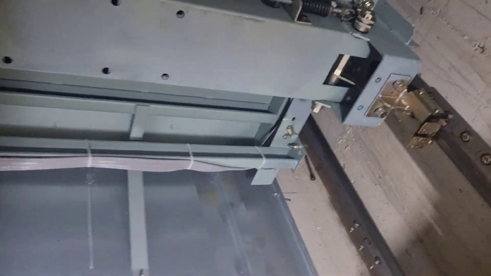
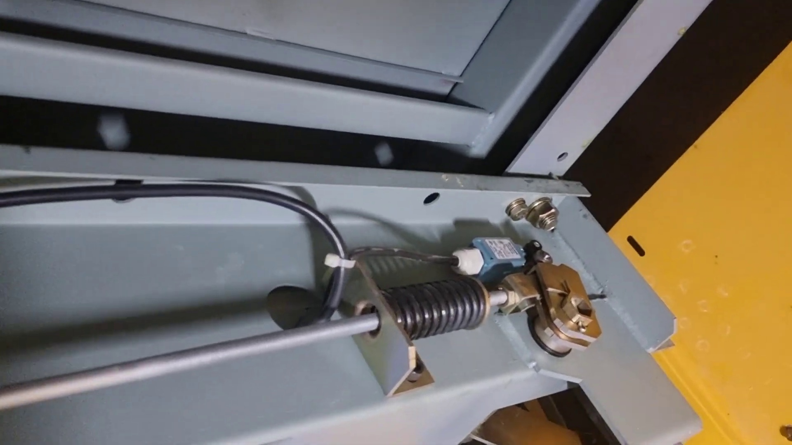
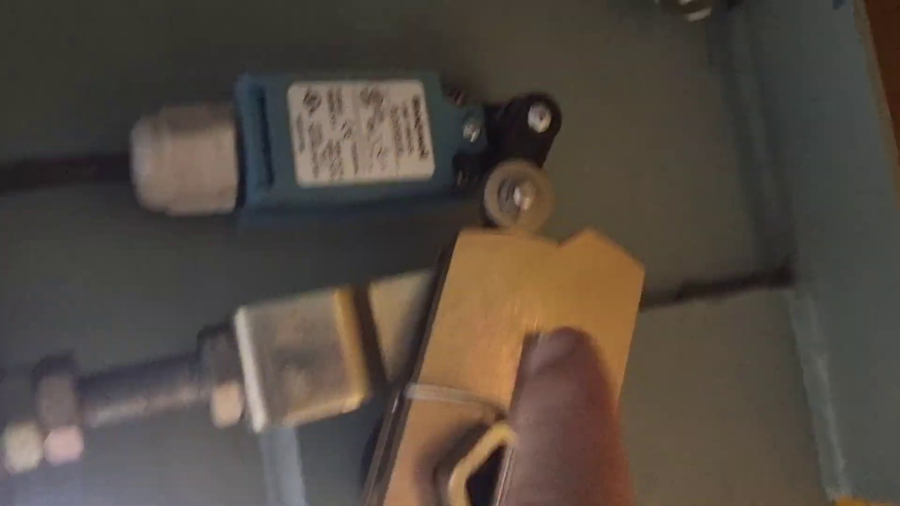
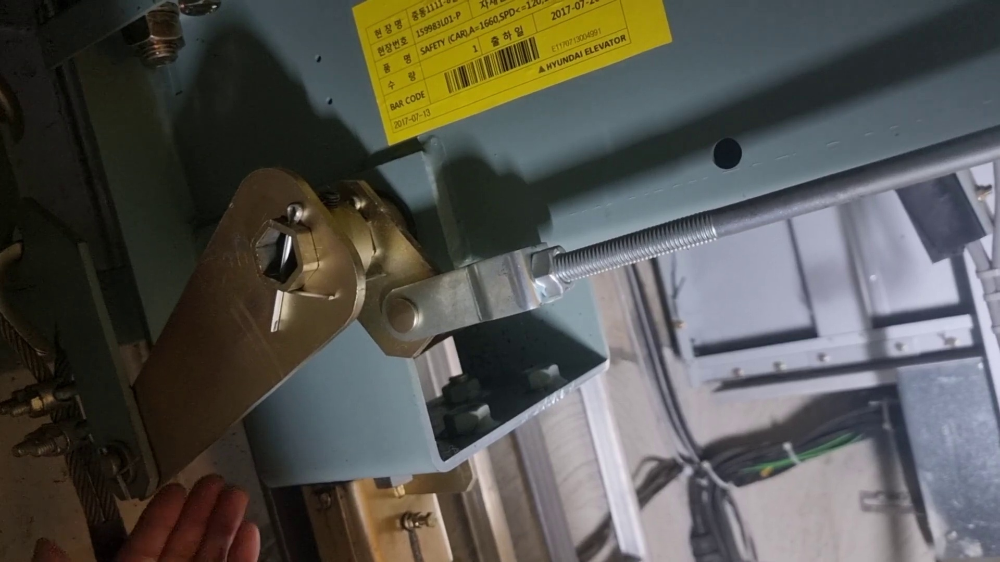
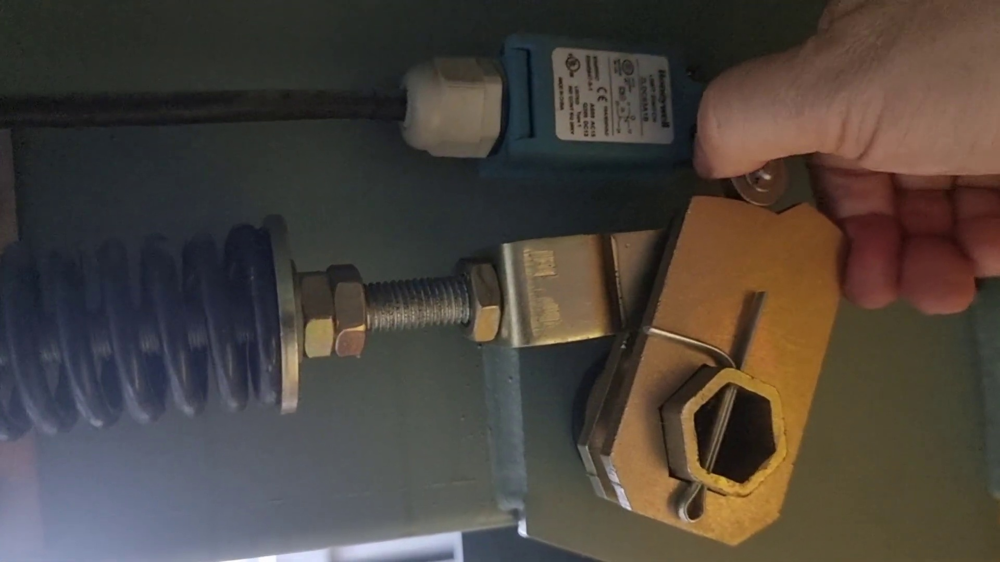
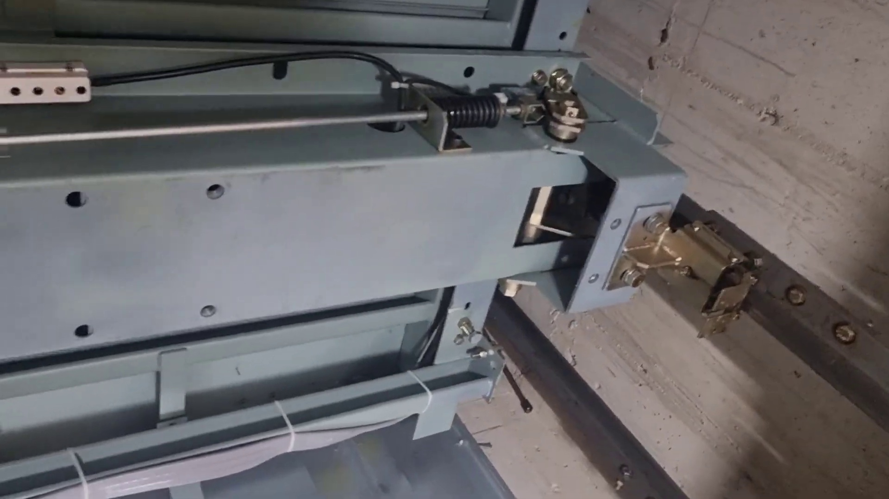
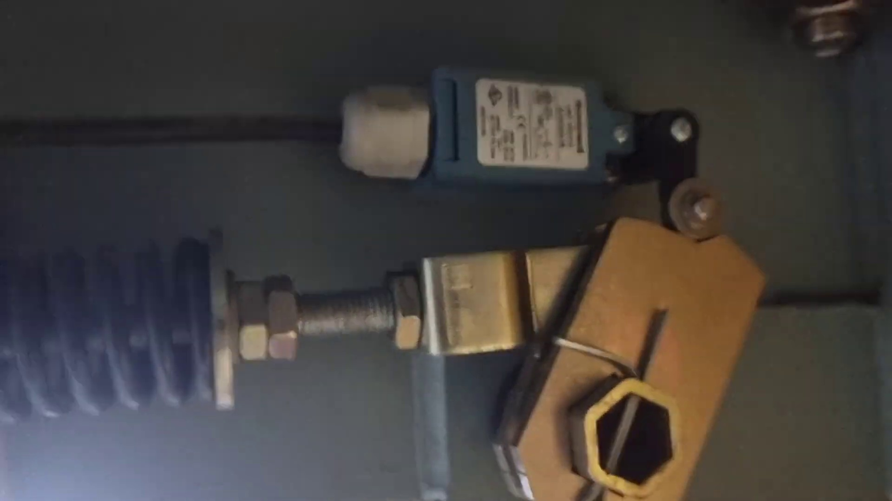
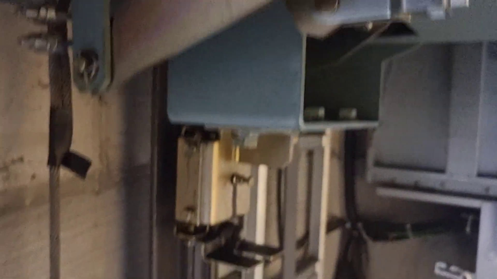
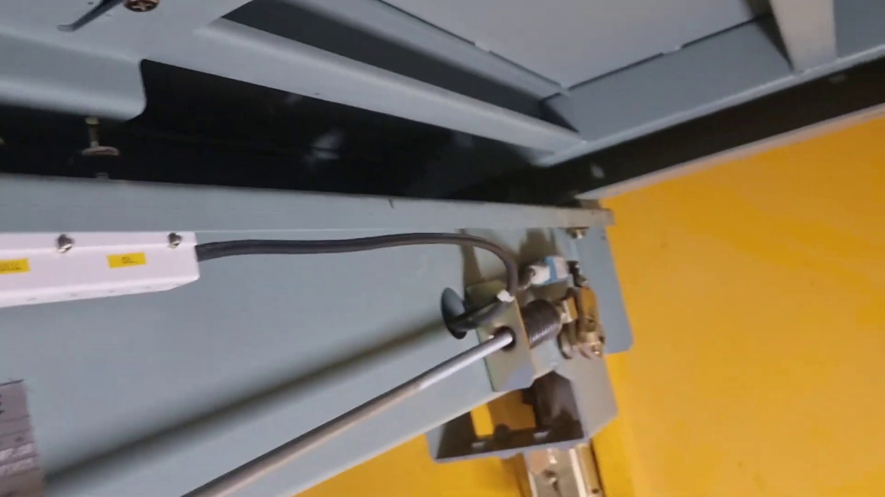
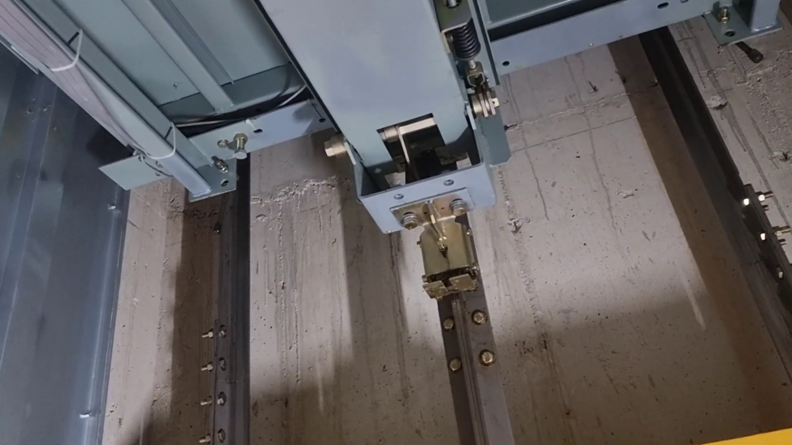

# 현대엘리베이터 카 세이프티 스위치 및 장죽(연동로드) 메커니즘 프레임 분석

- **분석 영상**: `temporary/safety_switch_device_elbaksa.mp4` (엘박사 현장 실무 강의)
- **대상 장치**: 현대엘리베이터 MRL 카 상부 비상정지 연동 장치 (명판: `SAFETY (CAR)`, 2017년 출하)
- **추출 프레임 저장 경로**: `docs/safety_switch_device/frames/`

---

## 1. 핵심 프레임별 상세 분석

### [Frame 01] 카 상부 크로스헤드 빔과 장죽(수평 로드) 전체 조망 (129.0s)

- **위치 및 배치**: 카 상부 크로스헤드(Crosshead) 채널 보의 전면 상단 모서리를 따라 수평으로 긴 은색 환봉(**장죽 / Actuating Cross-Rod**)이 가로지릅니다.
- **장죽의 지지 구조**: 보 중간에 가이드 브라켓이 장죽을 지지하여 처짐이나 횡방향 유격을 방지합니다.
- **연동 유닛**: 한쪽 끝단에 브라켓, 굵은 흑색 압축 스프링, 캠 플레이트, 그리고 수평으로 누워있는 리미트 스위치가 조립되어 있습니다.
- **케이블 배선**: 스위치 후면 케이블 글랜드에서 나온 흑색 제어선이 카 상부 전선 덕트/타이 마운트를 따라 안전회로로 연결됩니다.

---

### [Frame 02] 세이프티 스위치 & 스프링 조립체 뭉치 (144.0s)

- **스프링 장착 방식**: 장죽 환봉이 크로스헤드 보에 고정된 ㄷ자형 아연도금 브라켓 홀을 관통하고, 그 브라켓과 로드 끝단 사이에 **굵은 흑색 압축 코일 스프링**이 장죽 축선 상에 동축(Coaxial)으로 끼워져 있습니다.
- **조절 나사부**: 로드 끝단은 수나사(M14~M16)로 가공되어 있어 원형 와셔와 조절 너트(Double Jam Nut)가 스프링을 일정한 예압(Preload)으로 누르고 있습니다.
- **스위치 배치**: Honeywell 리미트 스위치가 **가로 방향으로 수평 장착**되어 있습니다. 스위치 본체는 푸른색이며 케이블 글랜드가 안쪽(로드 방향)으로, 롤러 레버가 바깥쪽(캠 방향)으로 배치되어 있습니다.

---

### [Frame 03] Honeywell 세이프티 리미트 스위치 정밀 규격 (169.0s)

- **제조사 및 모델**: **Honeywell LIMIT SWITCH SZL-VL-S / 2LDC03A1B** (CE / UL 인증 방수 소형 리미트 스위치).
- **외형 형상**:
  - 본체: 청색(Blue) 절연 수지 하우징.
  - 전면: 규격 및 전기 회로도(NC/NO)가 인쇄된 백색 라벨.
  - 배선 인입: 좌측 원통형 회색/백색 케이블 글랜드(Cable Gland).
  - 작동 기구: 우측 상단 회전축에 결합된 흑색 롤러 레버 암 + 스틸 롤러 휠(Roller Wheel).
- **동작 원리**: 롤러 휠이 하부의 골드 캠 플레이트 원호면에 항상 접촉하고 있으며, 캠이 회전하면 롤러가 튀어 올라가며 스위치 내부 접점(NC, B접점)이 열려 엘리베이터 안전회로를 즉시 차단합니다.

---

### [Frame 04] 트립 레버, 클레비스(요크) 조인트 및 명판 (204.0s)

- **현대엘리베이터 명판**: 크로스헤드 상단에 황색 라벨(`HYUNDAI ELEVATOR`, 품명 `SAFETY (CAR)`, 바코드 라벨)이 부착되어 있습니다.
- **클레비스(Clevis / 요크 조인트)**:
  - 장죽 끝단의 나사산 로드가 U자형 클레비스에 나사 결합되고 잼 너트로 고정됩니다.
  - 클레비스 핀(Clevis Pin)이 관통하여 아연도금 골드 트립 레버 플레이트에 연결됩니다.
- **조속기 로프 풀 바(Pull Bar) 연결**:
  - 회전 레버의 외측 끝단은 과속조절기(거버너) 로프를 물고 있는 와이어 클립/클램프와 연동됩니다.
  - 작업자가 손으로 들어올리는 동작(로프 인양 시뮬레이션)을 통해 레버가 회전축을 중심으로 상향 회전함을 보여줍니다.

---

### [Frame 05] 캠 플레이트, 육각 축, 코터 핀 및 스프링부 초정밀 접사 (249.0s)

- **캠 플레이트(Cam Plate)**:
  - 두께 약 6~8mm의 황색 크로메이트 도금 강판.
  - 상단 엣지는 스위치 롤러가 부드럽게 타고 넘어가도록 곡면(R)과 단차 턱(Cam Step)으로 가공되어 있습니다.
- **중심 회전축**:
  - 중심에 대형 육각 너트/보스가 결합되어 있으며, 풀림 방지용 **분할 핀(Split Cotter Pin)**이 관통되어 단단히 꽂혀 있습니다.
- **스프링 및 조절부**:
  - 스프링 선경 약 4.5~5mm, 외경 약 32mm의 고장력 흑색 압축 스프링.
  - 스프링 시트 와셔 + 조절 육각 너트 2개가 나사산 로드에 체결되어 스프링의 압축량(복귀 반력)을 정밀 튜닝합니다.

---

### [Frame 06] 장죽의 반대편 횡단 및 맞은편 연동 링크 (124.0s)

- **장죽의 목적**: 한쪽에서 조속기 로프가 레버를 당겨 올릴 때, 카의 **반대편에 있는 추락방지장치(Safety Gear)도 100% 동일한 힘과 타이밍으로 동작**시키기 위해 크로스헤드 보를 가로질러 반대편 레버 축으로 회전력을 전달합니다.
- **반대편 구성**: 반대편에도 동일하게 회전 레버가 있어, 장죽이 축 방향으로 당겨질 때 반대편 레버를 동일 각도로 끌어올립니다.

---

### [Frame 07] 캠 회전과 리미트 스위치 트립/복귀 동작 (309.0s)

- **트립 동작 (비상 정지 시)**:
  - 조속기 로프가 레버를 당김 → 레버 및 캠 플레이트 회전 → 캠 턱이 스위치 롤러를 밀어 올림 → 스위치 OFF (안전회로 차단).
- **복귀 동작 (카 인양 시)**:
  - 카를 위로 들어올리면 하부 웨지가 빠지고, 장죽의 흑색 압축 코일 스프링이 강력한 복귀 탄성력으로 장죽과 캠 플레이트를 밀어 대기 위치로 복귀시킴.
  - 캠 턱이 원래 위치로 내려오면서 스위치 롤러가 복귀하여 스위치 접점 ON (안전회로 정상화).
- **영상 속 고장 원인**: 그리스 경화 또는 이물질로 캠 축이 뻑뻑하여 스프링 힘만으로 스위치 롤러가 완전히 단차 아래로 복귀하지 못해 안전라인이 살지 않았던 현상.

---

### [Frame 08] 상부 보 엔드, 가이드슈 및 조속기 로프 경로 (359.0s)

- 크로스헤드 보 끝단 하부에 상부 가이드슈가 볼트 체결되어 있으며, 그 외측 레일 라인을 따라 조속기 와이어 로프가 수직으로 주행합니다.

---

### [Frame 09] 트립 레버 인양 동작 (224.0s)

- 조속기 로프가 작동할 때 트립 레버가 위로 들려올라가는 각도(약 20~25도)와 장죽이 당겨지는 변위(약 20~30mm)를 직접 보여줍니다.

---

### [Frame 10] 크로스헤드 보 하부 및 수직 연동 로드 인하부 (49.0s)

- 크로스헤드 레버 회전축에서 카 측면 프레임(Stile)을 따라 하부 세이프티 기어 블록(Safety Plank의 웨지 캐리어)으로 수직 연동 타이 로드가 내려가는 연결 통로를 보여줍니다.

---

## 2. 우리 시뮬레이터 프로젝트와의 좌우 배치 반전 매핑 계약

| 항목 | 영상 (`safety_switch_device_elbaksa.mp4`) | 우리 시뮬레이터 (`simmul`) |
| :--- | :--- | :--- |
| **조속기(거버너) 로프 위치** | 카 기준 **좌측 (-X)** 승강로 벽면 | 카 기준 **우측 (+X)** 승강로 벽면 (`GOV_TENS_X = +1.4275`) |
| **세이프티 스위치 & 캠 유닛 위치** | 크로스헤드 빔 **좌측 (-X)** | 크로스헤드 빔 **우측 (+X)** |
| **압축 코일 스프링 위치** | 크로스헤드 빔 **좌측 (-X)** (브라켓-클레비스 사이) | 크로스헤드 빔 **우측 (+X)** (브라켓-클레비스 사이) |
| **장죽(Actuating Rod) 주행 방향** | 좌측(-X) 유닛에서 **우측(+X) 반대편 레버**로 횡단 | 우측(+X) 유닛에서 **좌측(-X) 반대편 레버**로 횡단 |
| **스위치 본체 배치 방향** | 수평 가로 배치 (글랜드: 안쪽, 롤러: 바깥쪽) | 수평 가로 배치 (글랜드: 안쪽 -X 방향, 롤러: 바깥쪽 +X 캠 방향) |
| **하부 세이프티 기어로의 전달** | 좌·우 양측 수직 링크가 하부 플랭크로 하강 | 좌·우 양측 수직 링크가 하부 플랭크로 하강 |
